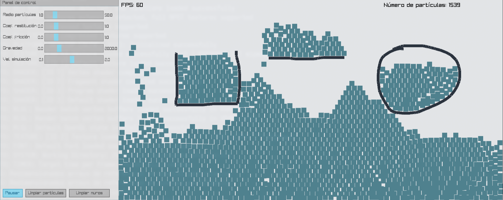

Simulación de partículas en C con Raylib/Raygui.

Algunas características:
* Spawn dinámico de partículas con click izquierdo y creación de muros manteniendo click derecho.
* Movimiento de partículas usando integración de Verlet.
* Resolución de colisiones basada en PBD (Position Based Dynamics) aplicando fricción y restitución.
* Particiones espaciales para detección de colisiones partícula-partícula y partícula-muro (uniform grid).
* Control de algunos parámetros de simulación en tiempo real.

# Compilación:

```bash
make
```

# Ejecución:

```bash
./exec
```
